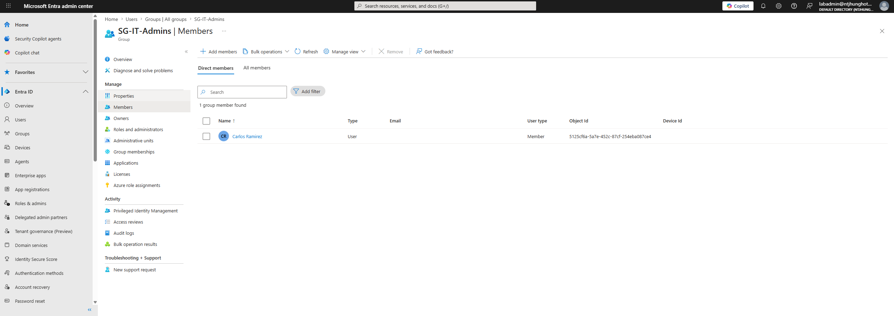
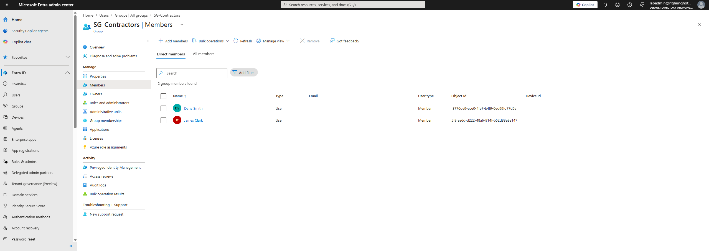

# Identity Governance Access Review Simulation

## Project Summary

This project demonstrates a manual identity governance access review process. The lab simulates how an IAM team can review user access, collect reviewer decisions, track remediation, and prepare audit evidence.

This project does not require Microsoft Entra ID P1 or P2 licensing. Instead of using the built-in Microsoft Entra access review feature, this lab uses a manual access review process based on group membership review, reviewer instructions, decision tracking, remediation documentation, and audit evidence.

## Business Problem

Organizations need to regularly confirm that users still require access to sensitive systems, groups, and applications. Without regular access reviews, users may keep access they no longer need, which increases security, compliance, and audit risk.

## What I Built

- Created a manual access review plan
- Created reviewer instructions
- Created sample access review data
- Reviewed HR, Finance, IT Admin, and Contractor groups
- Built a remediation tracker
- Built an access review risk matrix
- Created an audit evidence packet
- Collected group membership screenshots as evidence

## Screenshots

### Finance Group Access Review

### IT Admins Access Review

### Contractors Access Review

## Documentation Summary

### Review Scope

The review evaluated whether users still needed access based on department, job role, contractor status, privileged access risk, business need, and least privilege.

### Review Decision Options

| Decision | Meaning |
|---|---|
| Approve | User still needs access |
| Remove | User no longer needs access |
| Review Further | More information is needed before deciding |

### Review Results Summary

| Decision | Count |
|---|---|
| Approve | 6 |
| Remove | 1 |
| Review Further | 1 |

### Items Requiring Follow-Up

| User | Group | Required Action |
|---|---|---|
| Carlos Ramirez | SG-IT-Admins | Validate continued need for privileged access |
| Dana Smith | SG-Contractors | Remove contractor access |

## Skills Demonstrated

- Identity governance
- Access reviews
- Least privilege analysis
- Group membership review
- Risk-based access review
- Remediation tracking
- Audit evidence collection
- IAM documentation

## Resume Bullet

Built a manual identity governance access review simulation for Microsoft Entra ID groups, including reviewer instructions, access review planning, remediation tracking, least privilege analysis, and audit evidence documentation.

[Back to Home](../index.md)
