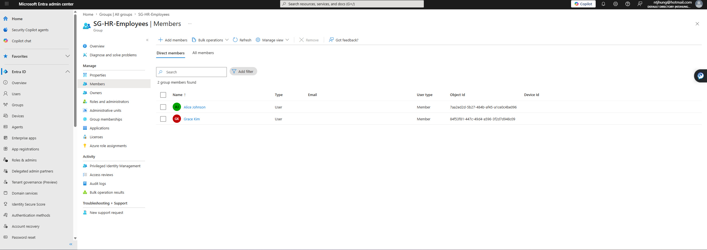

# Entra ID User Lifecycle Automation

## Project Summary

This project demonstrates a basic Identity and Access Management user lifecycle workflow using Microsoft Entra ID. The lab simulates how an organization can onboard users, assign group-based access, document access controls, and offboard users when access is no longer needed.

## Business Problem

Companies need a repeatable process for onboarding, updating, and offboarding users. Without a consistent process, users may receive incorrect access, keep access longer than needed, or create audit and security risks.

## What I Built

- Created sample users in Microsoft Entra ID
- Created department-based security groups
- Assigned users to groups based on role and department
- Created a Joiner-Mover-Leaver runbook
- Created an offboarding checklist
- Created an access control matrix
- Collected screenshots as audit evidence

## Screenshots

### Users Created

### HR Group Membership

### PowerShell Output

## Documentation Summary

### Joiner Process

A joiner is a new employee or contractor who needs access. The process includes creating the user account, assigning department-based access, requiring MFA registration, and documenting the request.

### Mover Process

A mover is an existing user who changes roles or departments. The process includes reviewing current group memberships, adding new required access, and removing access that is no longer needed.

### Leaver Process

A leaver is a user who leaves the organization. The process includes disabling the account, revoking sessions, resetting the password, removing group memberships, and saving evidence.

## Skills Demonstrated

- Microsoft Entra ID
- PowerShell
- Microsoft Graph
- User lifecycle management
- Group-based access control
- IAM documentation
- Audit evidence collection

## Resume Bullet

Built a Microsoft Entra ID user lifecycle automation lab using PowerShell and Microsoft Graph to simulate onboarding, group assignment, access removal, and audit evidence collection.

[Back to Home](../index.md)
