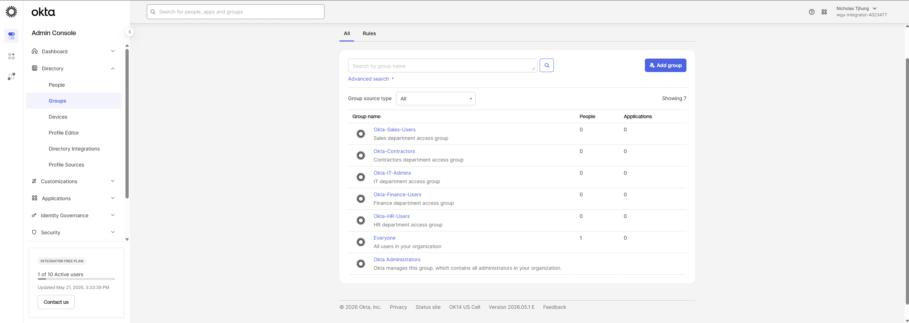
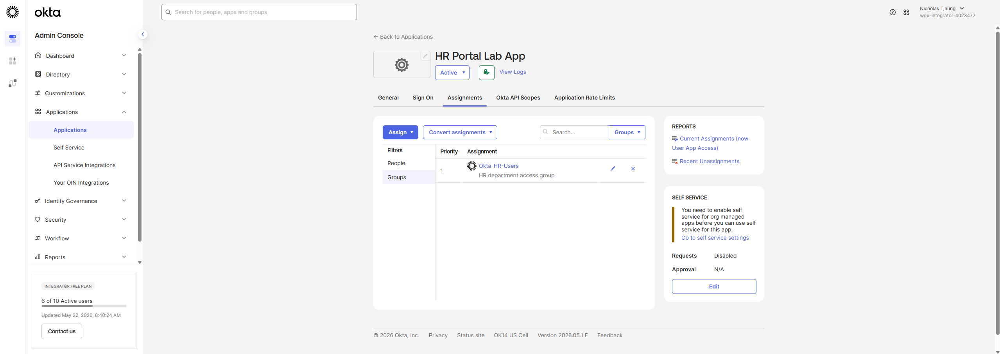
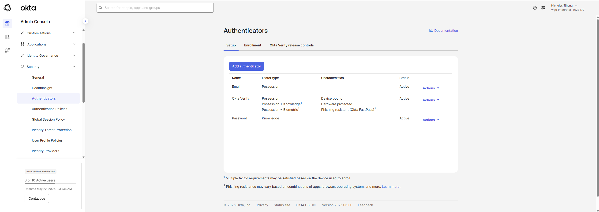

<!DOCTYPE html>
<html lang="en">
<head>
  <meta charset="UTF-8">
  <meta name="viewport" content="width=device-width, initial-scale=1.0">
  <title>Okta SSO and MFA Integration Lab | Nicholas Tjhung</title>
  <link rel="stylesheet" href="../style.css">
</head>

<body>

<header class="site-header">
  

    <a href="../index.html" class="brand">
      NT
      Nicholas Tjhung
    </a>

    <nav class="nav-links">
      <a href="../index.html">Home</a>
      <a href="../projects.html">Projects</a>
      <a href="../resume.html">Resume</a>
      <a href="../contact.html">Contact</a>
      <a href="https://github.com/ntjhung">GitHub</a>
    </nav>
  

</header>

<main class="container">

  <section class="hero" style="grid-template-columns: 1fr; max-width: 980px;">
    

      
IAM Case Study

      <h1>Okta SSO and MFA Integration Lab</h1>

      

        A hands-on Okta Identity and Access Management lab focused on users, groups, group-based application assignment, single sign-on concepts, MFA policy planning, troubleshooting, least privilege, and audit evidence documentation.
      

      

        Okta
        SSO
        MFA
        Group-Based Access
        App Assignment
        IAM Troubleshooting
        Audit Evidence
      

      

        <a class="btn btn-primary" href="../projects.html">Back to Projects</a>
        <a class="btn btn-secondary" href="../resume.html">View Resume</a>
        <a class="btn btn-secondary" href="../contact.html">Contact Me</a>
      

    

  </section>

  <section class="section">
    

      <article class="case-card">
        <h2>Project Summary</h2>
        

          This project demonstrates a basic Okta Identity and Access Management lab focused on users, groups, application assignment, single sign-on concepts, MFA policy planning, troubleshooting, and IAM documentation.
        

        

          The purpose of this lab is to show how Okta can centralize access management, improve authentication security, reduce manual access assignment, and support cleaner identity operations for cloud applications.
        

      </article>

      <aside class="case-card">
        <h2>Tools and Concepts</h2>

        

          Okta Admin Console
          Users
          Groups
          Applications
          SSO Concepts
          MFA Policy
          App Assignment Matrix
          Troubleshooting Notes
        

      </aside>

    

  </section>

  <section class="section">
    

      <article class="case-card">
        <h2>Business Problem</h2>
        

          Organizations often use many cloud applications, and manually assigning access to each user can create security and operational problems. Users may receive incorrect access, keep access longer than needed, or experience inconsistent sign-in and MFA behavior.
        

        

          Okta helps centralize identity management by using users, groups, app assignments, SSO, and MFA policies. A well-designed Okta setup supports least privilege, easier access reviews, better security controls, and a smoother user sign-in experience.
        

      </article>

      <aside class="case-card">
        <h2>Why It Matters</h2>
        <ul class="case-list">
          <li>Centralizes access to cloud applications</li>
          <li>Reduces manual user-by-user app assignment</li>
          <li>Supports group-based access control</li>
          <li>Improves authentication security with MFA</li>
          <li>Makes troubleshooting access issues easier</li>
          <li>Creates evidence for IAM documentation and audits</li>
        </ul>
      </aside>

    

  </section>

  <section class="section">
    

      <h2>What I Built</h2>

      <ul class="case-list">
        <li>Created Okta users for a simulated organization.</li>
        <li>Created Okta groups based on role and department.</li>
        <li>Assigned users to groups using group-based access logic.</li>
        <li>Created lab application integrations.</li>
        <li>Assigned applications to groups instead of assigning access directly to every user.</li>
        <li>Documented an MFA policy for sensitive users and groups.</li>
        <li>Created an application assignment matrix.</li>
        <li>Created Okta troubleshooting notes for common IAM support scenarios.</li>
        <li>Collected screenshots as audit evidence.</li>
      </ul>
    

  </section>

  <section class="section">
    <h2 class="section-title">Screenshots and Evidence</h2>
    

      These screenshots show Okta groups, group-based application assignment, and authenticator configuration used as evidence for the lab.
    

    

      <article class="screenshot-card">
        
        

          <h3>Okta Groups List</h3>
          
Group structure used to support role-based and department-based access assignment.

        

      </article>

      <article class="screenshot-card">
        
        

          <h3>App Group Assignment</h3>
          
Application access assigned through groups to support least privilege and easier access reviews.

        

      </article>

      <article class="screenshot-card">
        
        

          <h3>Okta Authenticators</h3>
          
Authenticator evidence used to document MFA planning and authentication security controls.

        

      </article>

    

  </section>

  <section class="section">
    

      <article class="case-card">
        <h2>Group-Based Access Design</h2>
        

          Users were assigned to groups based on department or role. Application access was assigned through groups instead of assigning apps broadly to everyone or manually assigning each user one-by-one.
        

        <ul class="case-list">
          <li>Created role-based and department-based groups.</li>
          <li>Assigned users to groups based on business need.</li>
          <li>Mapped applications to the correct groups.</li>
          <li>Reduced direct user assignments where possible.</li>
          <li>Used group membership as evidence for access control documentation.</li>
        </ul>
      </article>

      <article class="case-card">
        <h2>MFA Policy Planning</h2>
        

          MFA was documented for sensitive users and groups, including HR, Finance, IT Admins, Contractors, and users requiring stronger authentication controls.
        

        <ul class="case-list">
          <li>Identified groups that should require MFA.</li>
          <li>Documented MFA expectations for sensitive access.</li>
          <li>Reviewed authenticator options.</li>
          <li>Considered different user groups and access risk levels.</li>
          <li>Collected authenticator screenshots as evidence.</li>
        </ul>
      </article>

    

  </section>

  <section class="section">
    

      <article class="case-card">
        <h2>Application Assignment Matrix</h2>
        

          The application assignment matrix documents which groups should receive access to each application. This supports clearer access reviews and makes it easier to troubleshoot missing or incorrect app access.
        

        <ul class="case-list">
          <li><strong>HR Users:</strong> HR-related application access.</li>
          <li><strong>Finance Users:</strong> Finance-related application access.</li>
          <li><strong>IT Admins:</strong> Administrative or support application access.</li>
          <li><strong>Contractors:</strong> Limited access based on contract needs.</li>
          <li><strong>MFA Required Users:</strong> Users requiring stronger authentication controls.</li>
        </ul>
      </article>

      <article class="case-card">
        <h2>Troubleshooting Notes</h2>
        

          The project includes troubleshooting scenarios that map to common IAM support tickets and service desk escalations.
        

        <ul class="case-list">
          <li>User cannot see an assigned application.</li>
          <li>User receives an unexpected MFA prompt.</li>
          <li>User does not receive an expected MFA prompt.</li>
          <li>Contractor has more access than expected.</li>
          <li>Admin access needs review or validation.</li>
          <li>Group membership does not match application access.</li>
        </ul>
      </article>

    

  </section>

  <section class="section">
    

      <article class="case-card">
        <h2>Access Control Approach</h2>
        

          This lab uses group-based access assignment to support least privilege and cleaner administration. Instead of assigning every user directly to every application, users receive access based on their group membership.
        

        <ul class="case-list">
          <li>Assign access based on role or department.</li>
          <li>Limit contractor access to only what is required.</li>
          <li>Review sensitive groups more carefully.</li>
          <li>Use group membership to support access reviews.</li>
          <li>Document app assignments for audit evidence.</li>
        </ul>
      </article>

      <aside class="case-card">
        <h2>Skills Demonstrated</h2>

        

          Okta Administration
          SSO Concepts
          MFA Policy Planning
          Group-Based App Assignment
          Least Privilege
          IAM Troubleshooting
          Access Control Documentation
          Audit Evidence Collection
        

      </aside>

    

  </section>

  <section class="section">
    

      <h2>Resume Bullet</h2>

      

        Built an Okta SSO and MFA lab with users, groups, group-based application assignment, MFA policy documentation, access control planning, troubleshooting notes, and audit evidence screenshots.
      

    

  </section>

  <section class="section">
    

      <h2 class="section-title">Recruiter Takeaway</h2>
      

        This project shows that I understand Okta fundamentals beyond basic navigation. It demonstrates users, groups, group-based application access, SSO concepts, MFA planning, least privilege, troubleshooting, and documentation that can support IAM operations and access reviews.
      

      

        <a class="btn btn-primary" href="../projects.html">Back to Projects</a>
        <a class="btn btn-secondary" href="../resume.html">View Resume</a>
        <a class="btn btn-secondary" href="../contact.html">Contact Me</a>
      

    

  </section>

</main>

<footer class="footer">
  

    
© 2026 Nicholas Tjhung · IAM Portfolio

  

</footer>

</body>
</html>
