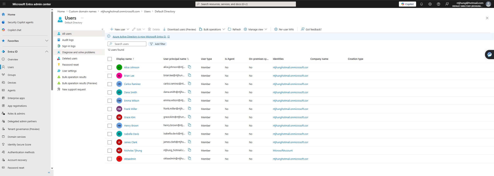
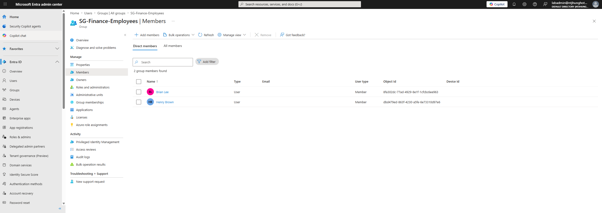
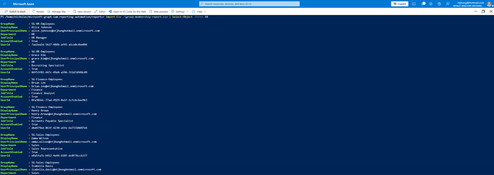

<head>
 <link rel="stylesheet" href="style.css">
</head>

<header class="site-header">
  

    <a href="index.html" class="brand">
      NT
      Nicholas Tjhung
    </a>

    <nav class="nav-links">
      <a href="index.html">Home</a>
      <a href="projects.html">Projects</a>
      <a href="resume.html">Resume</a>
      <a href="contact.html">Contact</a>
      <a href="https://github.com/ntjhung">GitHub</a>
    </nav>
  

</header>

<main class="container">
  <section class="hero">
    

      
Identity & Access Management Portfolio

      <h1>Microsoft Entra ID, Okta, and IAM Security Projects</h1>

      

        IT professional with 5+ years of systems administration experience and hands-on IAM projects covering Microsoft Entra ID, Okta, Conditional Access, MFA, access reviews, Microsoft Graph, PowerShell automation, and audit evidence documentation.
      

      

        <a class="btn btn-primary" href="projects.html">View Projects</a>
        <a class="btn btn-secondary" href="resume.html">View Resume</a>
        <a class="btn btn-secondary" href="contact.html">Contact Me</a>
      

    

    <aside class="profile-card">
      
NT

      <!-- To use a real headshot later, replace the line above with:
      
      -->

      <h2>Nicholas Tjhung</h2>
      
IAM | Entra ID | Okta | Microsoft 365 Security

      

        Microsoft
        Okta
        GitHub
        LinkedIn
      

    </aside>
  </section>

# Identity and Access Management Portfolio

Identity and Access Management portfolio focused on Microsoft Entra ID, Okta, Conditional Access, access reviews, Microsoft Graph, PowerShell, and IAM automation.

## About Me

I’m an IT professional with 5+ years of systems administration experience, focused on Identity and Access Management and Microsoft identity technologies. My hands-on portfolio includes Microsoft Entra ID, Okta, MFA, Conditional Access planning, identity governance, access reviews, Microsoft Graph reporting, PowerShell automation, and audit evidence documentation.

## Featured IAM Projects

---

## 1. Entra ID User Lifecycle Automation

Built a Microsoft Entra ID user lifecycle automation lab using PowerShell and Microsoft Graph to simulate onboarding, group assignment, access removal, and audit evidence collection.

**Skills shown:** Entra ID, PowerShell, Microsoft Graph, user lifecycle, group-based access, onboarding, offboarding, audit evidence.

[View Case Study](case-studies/entra-lifecycle.md)

---

## 2. Conditional Access Security Baseline Design

Designed a Microsoft Entra Conditional Access security baseline with MFA enforcement strategy, admin protection, legacy authentication blocking, break-glass planning, report-only rollout strategy, rollback documentation, and licensing limitation evidence.

**Skills shown:** Conditional Access planning, MFA strategy, break-glass planning, rollback planning, security documentation, IAM policy design.

[View Case Study](case-studies/conditional-access.md)

---

## 3. Identity Governance Access Review Simulation

Built a manual identity governance access review simulation for Microsoft Entra ID groups, including reviewer instructions, access review planning, remediation tracking, least privilege analysis, and audit evidence documentation.

**Skills shown:** Identity governance, access reviews, least privilege, remediation tracking, group membership review, audit evidence.

[View Case Study](case-studies/access-review.md)

---

## 4. Okta SSO and MFA Integration Lab

Built an Okta SSO and MFA lab with users, groups, group-based application assignment, MFA policy documentation, access control planning, troubleshooting notes, and audit evidence screenshots.

**Skills shown:** Okta administration, SSO concepts, MFA policy planning, group-based app assignment, least privilege, IAM troubleshooting.

[View Case Study](case-studies/okta.md)

---

## 5. Microsoft Graph IAM Reporting Automation

Built a Microsoft Graph IAM reporting automation project using PowerShell and REST API calls to export Microsoft Entra ID users, groups, group memberships, and audit evidence reports for access review support.

**Skills shown:** Microsoft Graph, PowerShell, REST API, IAM reporting, CSV exports, group membership review, audit evidence, troubleshooting.

[View Case Study](case-studies/graph-reporting.md)

---

## Core Skills

- Microsoft Entra ID
- Okta
- Microsoft Graph
- PowerShell
- MFA
- Conditional Access Planning
- Access Reviews
- Identity Governance
- RBAC
- Group-Based Access Control
- User Provisioning
- Deprovisioning
- IAM Documentation
- Audit Evidence
- CSV Reporting
- Troubleshooting

## Certifications

- Microsoft 365 Certified: Administrator Expert
- Microsoft Certified: Cybersecurity Architect Expert
- Microsoft Certified: Identity and Access Administrator Associate
- Microsoft Certified: Azure Administrator Associate
- Microsoft Certified: Azure Fundamentals
- Certified ScrumMaster

## Links

- [Projects](projects.md)
- [Resume](resume.md)
- [Contact](contact.md)
- [GitHub Profile](https://github.com/ntjhung)
